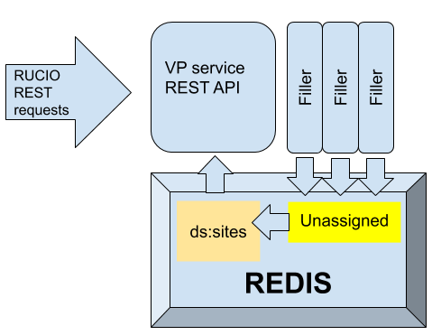

# VPservice
## Virtual Placement Service

Grid is described in file ```grid.json```. 
This is uploaded to the server using ```initialize_grid.py```. 
Each change in grid (adding/updating a site, deleting site) causes update in the grid version. Updated grid will take effect after unassigned VPs are used up (by default 300 VPs).
A site can be disabled and enabled. This does not change VPs but only removes disabled sites from response.
A site can be deleted in which case all it's assignements get reasigned to "other".
Filler makes sure there are more than LWM and less than HWM unassigned VPs in Redis. Unassigned VPs are there just to make it faster to deliver VPs. 



### CleanUp
    With time a lot of datasets that don't exist anymore get accumulated in REDIS. This procedure removes them. These are steps: 
    * get a shell in redis-master pod
    * copy paste commands from shell script *CleanUp/dumpKeys.sh*
    * scp produced keys.txt and values.txt files back to lxplus
    * on lxplus setup rucio, get grid proxy
    * place the downloaded files into CleanUp directory
    * execute: python clean_vp.py


### Tools 
    This directory contains several node.js scripts tools. *Some coding needed.*
    * fix.js - can go through all the keys and change them. 
    * dumpToES.js - dumps all of the current virtual placements to an index in ES.
